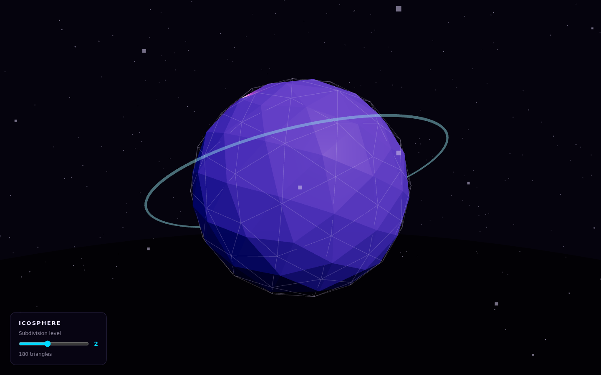
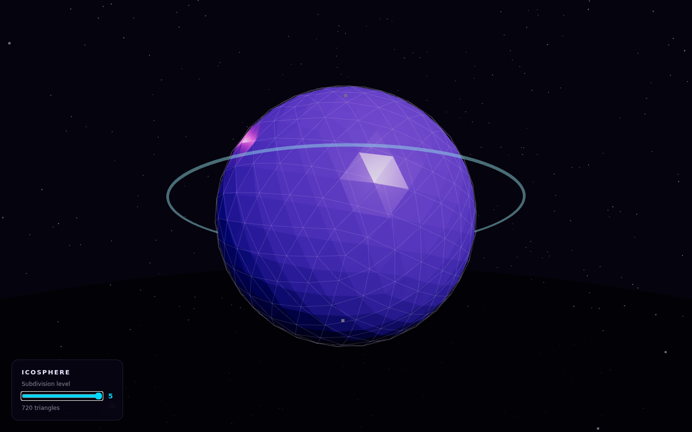

# Icosphere

An animated icosphere built with Three.js and vanilla JavaScript.

A flat-shaded icosahedron sits inside a counter-rotating wireframe shell, lit by a fixed key light and two coloured point lights that orbit it. A field of 900 particles surrounds the object, and the whole thing can be turned and zoomed with the mouse. A slider rebuilds the geometry live from 20 triangles up to 720, which is the part worth playing with: it is the subdivision that turns twenty flat faces into something that reads as a sphere.

**[Open the live demo](https://stiutin.github.io/threejs-icosphere/)**

<p align="center">
  
  
</p>

## Features

- Live subdivision control, rebuilding the geometry from level 0 to 5
- Triangle counter read back from the geometry itself
- Flat-shaded `IcosahedronGeometry` core with a standard PBR material
- Wireframe shell sharing the core's geometry, rotating on its own axes
- Two nested glow shells whose opacity pulses out of phase
- A thin torus ring tumbling around the object
- 900 particles distributed evenly through a spherical shell
- Cyan and magenta point lights orbiting on separate periods
- Subtle breathing scale on the core
- ACES filmic tone mapping with sRGB output
- Orbit controls with damping, clamped zoom and panning disabled
- Keyboard-operable slider with a live region announcing the new count
- Device pixel ratio capped at 2
- Static single frame when the visitor prefers reduced motion
- Explicit message when WebGL 2 is unavailable

## Tech stack

Vanilla JavaScript, [Three.js](https://threejs.org/), [Vite](https://vitejs.dev/), WebGL.
No framework, no UI library, no textures: everything in the scene is generated in code.
Tested with [Playwright](https://playwright.dev/).

## How it works

### Composition

Every tunable value lives in a single `CONFIG` object: colours, camera, geometry detail, particle counts, and the speed of each animated property. Nothing else in the file holds a magic number, so the whole look of the scene can be retuned from one place.

The object is built from four meshes that share one centre:

```
Mesh (icosahedron core, flat-shaded, slightly transparent)
  ├── Mesh (wireframe shell, same geometry, scaled 1.008)
  ├── Mesh (outer glow sphere, cyan)
  └── Mesh (inner glow sphere, magenta)
```

The wireframe reuses the core's geometry object rather than building a second one, so the two are guaranteed to stay in step and only one set of vertex buffers is uploaded to the GPU.

### Subdivision

The slider rebuilds `IcosahedronGeometry` on every change. The core and the wireframe shell point at the same geometry object, so both are repointed before the previous one is disposed. That `dispose()` call matters more than it looks: dropping the JavaScript reference does not free the vertex buffers, which live in GPU memory until they are explicitly released, and this path runs on every step of a slider drag.

The triangle count is read from `geometry.attributes.position.count / 3` rather than computed. Three.js subdivides each edge of the base icosahedron into `detail + 1` segments, which gives **20 × (detail+1)²** faces, not the 20 × 4^detail that recursive subdivision would produce:

| Level | 0   | 1   | 2   | 3   | 4   | 5   |
| ----- | --- | --- | --- | --- | --- | --- |
| Faces | 20  | 80  | 180 | 320 | 500 | 720 |

The division by three is exact because the geometry is non-indexed: vertices are not shared between faces, which is precisely what allows `flatShading` to give every triangle its own normal and produce the faceted look.

The wireframe's opacity falls off as the level rises. At level 5 a constant opacity turns the shell into a solid skin that hides the surface it is meant to describe.

### Transparency

The core is semi-transparent and the glow shells sit inside it. Transparent objects are drawn after opaque ones and sorted back to front by their centre, which is the same point for all four meshes here, so their relative order is not something to depend on. The shells therefore render with `depthWrite` disabled: they contribute colour without claiming depth, and whichever is drawn first cannot hide the others.

### Lighting

A hemisphere light fills the shadows with the scene's own violet, a white directional key light gives the facets their definition, and two point lights in cyan and magenta orbit the object on different periods so the highlights never repeat in the same arrangement. Because the facets are flat-shaded, each triangle picks up a single tone and the moving lights read as distinct planes turning through the light rather than a smooth gradient.

### Particles

Positions are generated once into a `Float32Array` using spherical coordinates with `acos(2r - 1)` for the polar angle, which distributes points evenly over a sphere instead of clustering them at the poles. They are drawn as a single `Points` object, so 900 particles cost one draw call.

### Animation

The render loop runs through `renderer.setAnimationLoop()`, which lets the browser stop it when the tab is hidden. Elapsed time comes from `THREE.Timer` connected to the document, so time spent on a hidden tab is discarded rather than arriving as one large jump on return.

Every animated property is a function of elapsed time rather than an accumulation per frame. Rotations, the breathing scale, the pulsing glow opacity and the orbiting lights are all derived from the same clock, which keeps them in phase at any frame rate and makes the whole scene reproducible from a single number.

That last property is what the reduced-motion path uses: instead of a frozen first frame, it composes the scene at a chosen timestamp and draws it once, then redraws only when the camera is dragged.

## Testing

| Layer      | Tool       | What it covers                                                                                |
| ---------- | ---------- | --------------------------------------------------------------------------------------------- |
| End-to-end | Playwright | the production build on desktop and mobile: loads without errors, controls work - 2 scenarios |

WebGL output is hard to assert pixel by pixel, so the tests check behaviour instead: no uncaught errors or console messages, the canvas appears, and the controls do what they say. CI runs the suite against the exact build it deploys.

## Project structure

```
src/
├── main.js          # configuration, scene factories, animation
└── style.css        # page reset, the panel and the WebGL fallback message

e2e/                 # Playwright smoke tests
scripts/             # README screenshots
.github/workflows/   # CI: lint, build, smoke tests, deploy to GitHub Pages
```

## Running locally

Requires Node 22.22.3 or newer (see `.nvmrc`).

```bash
git clone https://github.com/stiutin/threejs-icosphere.git
cd threejs-icosphere
npm ci
npm start
```

Other scripts:

```bash
npm run build          # production build into dist/
npm run serve          # serve the production build
npm run e2e            # build, then the Playwright smoke tests (run `npm run e2e:install` once)
npm run screenshots    # regenerate the README screenshots
npm run lint           # ESLint and Stylelint
npm run format         # Prettier
npm run check          # formatting and lint, as in CI
```

Working on the project with an AI assistant? [`CLAUDE.md`](CLAUDE.md) has the full context.

## Deployment

Pushing to `master` runs formatting and lint, then builds the site and runs the Playwright smoke tests against that build. Only when they pass is the same build published to GitHub Pages. Vite uses a relative `base`, so the files work under `/threejs-icosphere/` without any configuration.

## Roadmap

- [ ] Bloom via `EffectComposer`, which this palette is asking for
- [ ] Mouse parallax on the camera
- [ ] Custom GLSL material for the facets
- [ ] Particle motion beyond the rigid rotation of the whole field
- [ ] Full resource disposal, for embedding the scene in a larger app (geometry is already released on rebuild; materials and textures are not)

## License

Released under the [MIT License](LICENSE).

## Author

**Serge Tiutin** - [github.com/stiutin](https://github.com/stiutin)
